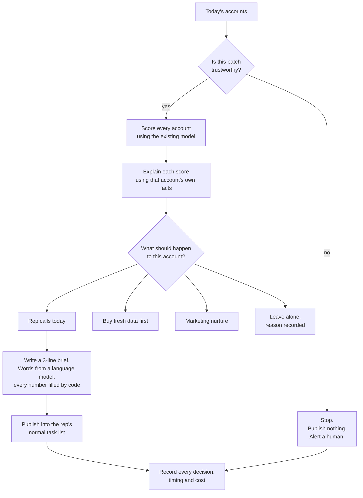
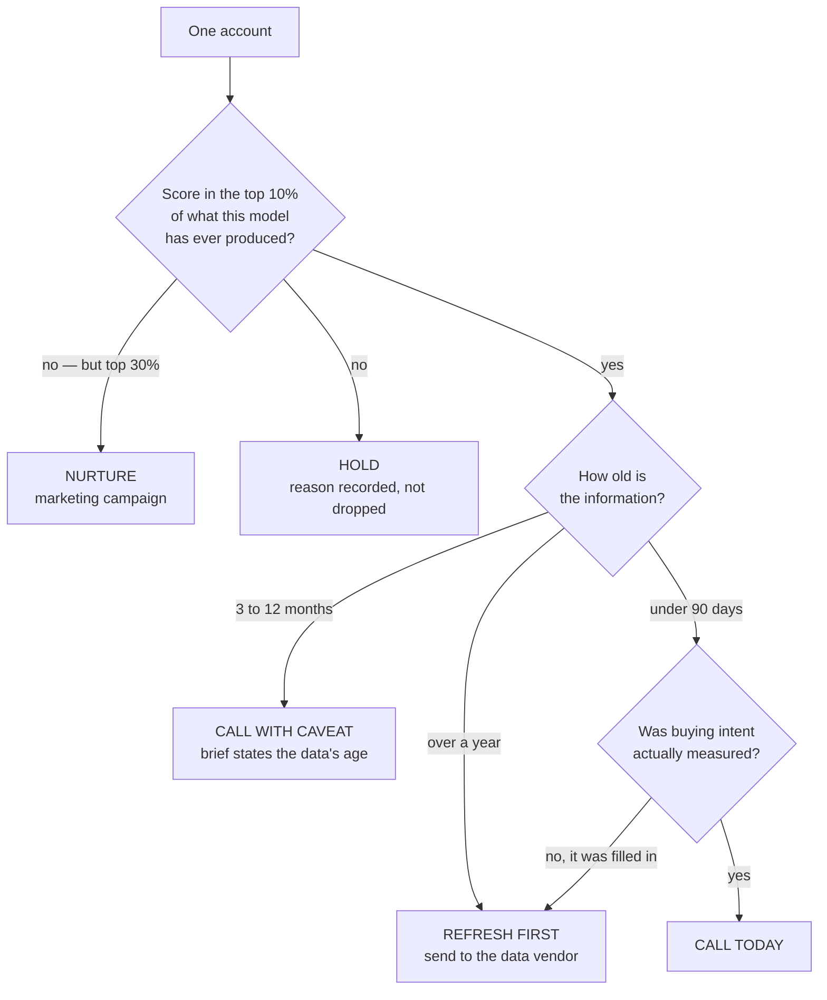
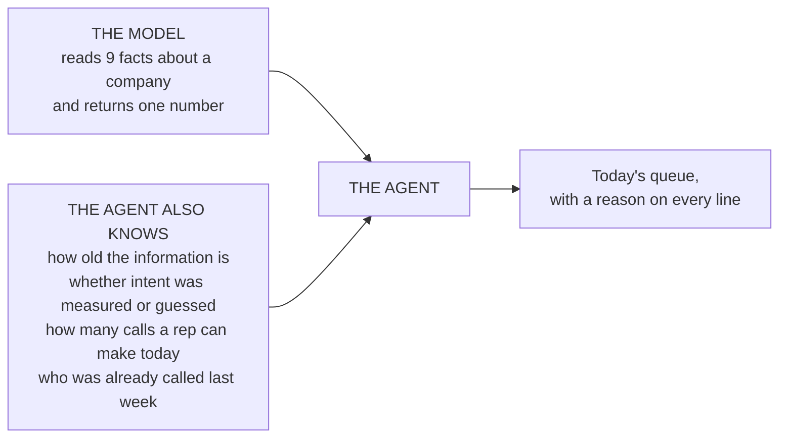
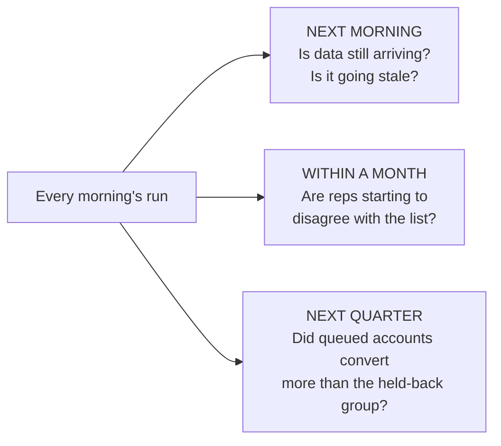
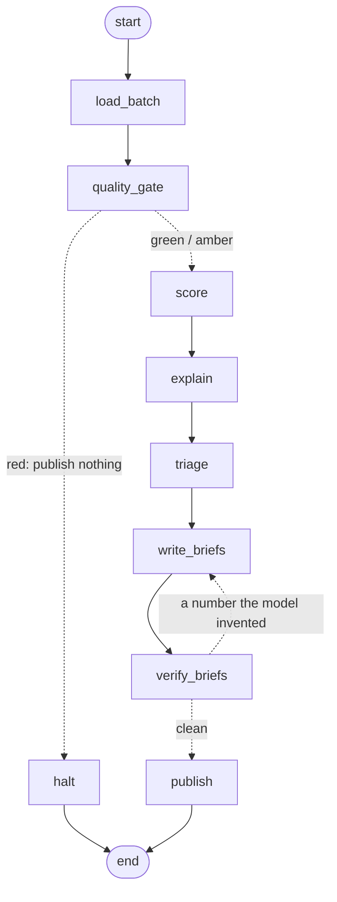

# Cordilla account triage

**A nightly agent that decides which accounts a rep should call tomorrow, which ones need fresh
data before anyone calls them, and which ones to leave alone — and records what it decided, how
long it took and what it cost.**

The scoring model already existed and sat unused. This repo is everything between "here is a
number" and "Priya knows who to call at 8:30 AM."

---

## The problem in 30 seconds

Cordilla has tens of thousands of non-customer accounts and a handful of reps. A rep can make
~40 calls a day, and cold conversion is **under 1%**. The only real lever is choosing better.

A model already exists that scores an account's chance of converting within 90 days. It works
reasonably well — but on its own it can't run a sales team, for three reasons we measured in
`analysis/`:

| What we found | Why it matters |
|---|---|
| **Its signal lives in the top 10% only.** Below that, the ordering is no better than chance | A ranked list of 300 is mostly noise. The list has to stop somewhere, and that cut is a decision the model can't make |
| **73% of the batch is working from information over 90 days old.** Its highest-scoring account was last updated in October 2025 | Every activity column counts a 90-day window. Past 90 days, the window it describes has already closed |
| **39% of accounts have no buying-intent data**, and the model's preprocessing fills the gap with an average | "We know nothing" silently becomes "normal interest" — on the model's single heaviest feature |

None of those are the model's fault. The date on the data was never one of its inputs.

---

## How it works



The rep never opens a dashboard or learns a new tool. The work appears where their work already is.

---

## What happens to a single account



Every threshold here is anchored to something measured, not chosen by taste:

| Rule | Value | Where it comes from |
|---|---|---|
| "Top 10%" | score ≥ **0.1088** | The 90th percentile of the model's scores on its own training data. Above it, conversion runs at 26.7% against a 6.5% base. Below it, ordering is noise |
| "Information too old" | **90 days** | Every feature counts a 90-day window. Past that, the window no longer overlaps the period we're predicting |
| "Expired" | **365 days** | Beyond a year, a call references events that are over a year stale |

An absolute cut, not "top 50 of today's batch" — so batches stay comparable, and a sudden overflow
is itself a warning sign.

---

## What the model sees, and what the agent adds



---

## How we'd know it stopped working

These systems rarely break loudly. The list keeps arriving, looks normal, and is slowly wrong.
Three checks, on three different clocks:



One bad week means nothing: with ~30 accounts in a weekly queue, the numbers bounce far too much to
read. Alerts fire on a four-week pattern instead. The arithmetic behind that is in `PROPOSAL.md`.

A small share of good-looking accounts is **deliberately held back** from the queue every run. It
costs a few calls. It's the only way anyone can ever prove this worked rather than claim it.

### The flow as the code actually runs it

Generated by `python -m agent.run --as-of 2026-08-01 --print-graph`, so it cannot
drift from the implementation:



`verify_briefs → write_briefs` is the cycle: any brief containing a number the model
typed itself goes back for another attempt, twice, then falls back to a template.
`publish` pauses for a human when the batch is amber.

---

## Setup

```bash
python -m venv .venv
source .venv/bin/activate          # Windows: .venv\Scripts\activate
pip install -r requirements.txt
```

Python 3.11 or 3.12 (numpy 1.26.4 has no wheels for 3.13). Dependencies are pinned to the versions the model was saved with
(`scikit-learn==1.5.2`); loading a pickle under a different version is a silent-corruption risk,
so this is deliberate.

## Run it

```bash
# 1. Regenerate every number quoted in PROPOSAL.md and this README
python analysis/profile.py

# 2. The agent: score the batch, decide, write the queue and the briefs
python -m agent.run --accounts data/accounts_to_score.csv --as-of 2026-08-01

# 3. The monitoring checks, standalone
python -m monitoring.checks --accounts data/accounts_to_score.csv --as-of 2026-08-01

# 4. Prove the monitoring catches a silent failure
python -m monitoring.demo_silent_failure
```

`--as-of` is required and never defaults to the system clock: both CSVs are snapshots taken on
2026-08-01, and every age in this repo is measured from that date.

---

## What it produces

| File | For whom | What it is |
|---|---|---|
| `outputs/call_queue.csv` | SDR | The accounts to call, best first, with reasons |
| `outputs/briefs.md` | SDR | Two or three lines per queued account, numbers filled by code |
| `outputs/enrichment_requests.csv` | RevOps | Accounts worth refreshing before anyone calls |
| `outputs/run_summary.txt` | Sales manager | Plain English, no jargon |
| `outputs/runs.jsonl` | AI transformation analyst | One line per run: counts, timings, cost, alerts |
| `outputs/decisions.csv` | AI transformation analyst | One row per account per run — joins to CRM outcomes later |

The last two are the observability layer. **This repo produces the records; it does not build the
dashboard** — that's the analyst's job, and they need clean data more than they need our charts.

Every cost and volume figure is tagged **measured** or **assumed**. The language model is mocked
(no API key is provided for this exercise), but the mock still builds the real prompt, counts the
tokens and prices them against a documented rate table — so the cost figure is honest about what it
is, and swapping in a live call changes the rates, not the plumbing.

---

## Where the numbers come from

Every figure in `PROPOSAL.md` and in this README is regenerated by `analysis/profile.py` into
`analysis/findings.json`. If a number isn't in that file, it isn't in the write-up.

---

## Repo map

```
analysis/     profile.py        measures the data and the model; writes findings.json
              findings.json     every number this repo quotes, regenerated by that script
agent/        run.py            entry point (--as-of is required, never the system clock)
              graph.py          the flow above, as a LangGraph state machine
              contracts.py      what a valid batch is; per-account quality flags
              scoring.py        loads the pickle safely, scores against a fixed contract
              policy.py         the thresholds, and why each one is what it is
              explain.py        why an account scored what it did
              brief.py          slot filling and the number verifier
              llm.py            the mocked language model, with the real plug-in point
              emit.py           the four audience-specific outputs
monitoring/   checks.py         the checks; baselines come from analysis/findings.json
              demo_silent_failure.py
              RUNBOOK.md        what each alert means, who owns it, first move
model/        model.pkl         provided, not retrained
data/         *.csv             provided, not modified
PROPOSAL.md                     impact, agent design, monitoring design
RESEARCH-LOG.md                 what was tried, what failed, what the AI got wrong
```

## What this is not

- Not a retrained or tuned model. The pickle is used exactly as provided.
- Not a lookup tool. Nobody types in an account number; the system pushes work out.
- Not an autonomous emailer. It queues work for humans and stops before anything leaves the building.
- Not a production service. No test suite, no packaging, no CI — the exercise asks for a working
  prototype, and that's what this is.
