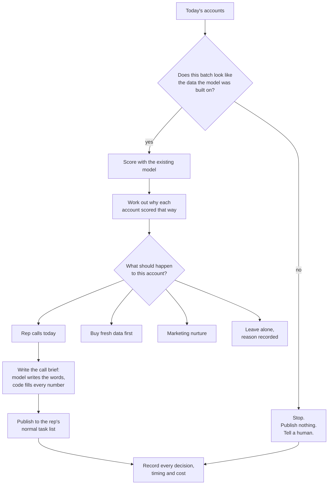
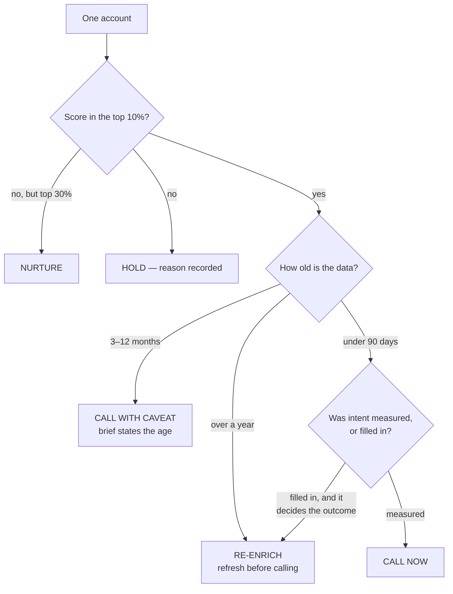
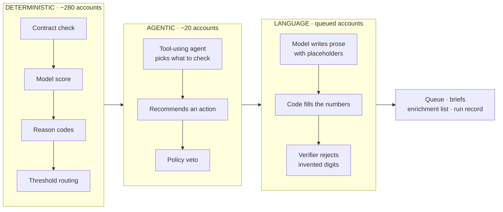
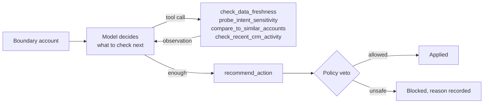
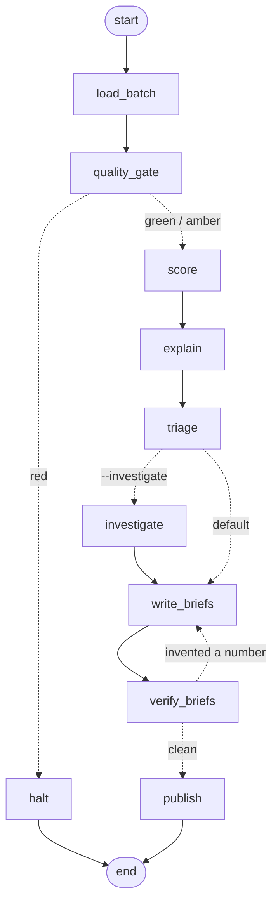

# Cordilla account triage

**Turns a scoring model nobody used into a rep's morning — and refuses to publish when the data
underneath it looks wrong.**

```bash
pip install -r requirements.txt
python analysis/profile.py
python -m agent.run --as-of 2026-08-01
```

Read `sample_run/` to see the output without installing anything.

**Optional, both off by default** — `cp .env.example .env`:
`ANTHROPIC_API_KEY` makes the call briefs live and unlocks `--investigate`;
`LANGSMITH_TRACING` + `LANGSMITH_API_KEY` turn on tracing, which needs no code at all.

---

## The problem

Cordilla has tens of thousands of non-customer accounts and five reps. A rep makes ~40 calls a day
and cold conversion is under 1%, so the only lever is **choosing better**.

A model already scored those accounts and then sat unused, because a number in a file changes
nobody's Tuesday. Three measured facts explain why it can't simply be switched on:

| What the data says | Why it matters |
|---|---|
| Signal lives in the **top 10% only** — below that the ordering is no better than chance | The list has to stop somewhere, and the model can't make that call. Its highest score is 0.27, so at a conventional 0.5 cutoff it never fires at all |
| **73% of accounts** carry information over 90 days old, and every feature counts a 90-day window | For **218 of 300 accounts the period being predicted has already closed** |
| **39% have no buying-intent data**, and the pipeline fills the gap with an average | "We know nothing" silently becomes "normal interest" — on the model's heaviest feature |

None of that is the model's fault: `snapshot_date` was never one of its inputs.

---

## What the agent does



The rep never opens a dashboard. The work appears where their work already is.

### How one account is decided



Every threshold traces to something measured:

| Rule | Value | Where it comes from |
|---|---|---|
| Top 10% | score ≥ **0.1088** | Training 90th percentile. Above it, conversion is 26.7% against a 6.5% base |
| Too old to act on | **90 days** | The features' own window — past it, nothing overlaps the period being predicted |
| Expired | **365 days** | A call would reference events more than a year old |

Absolute cuts, not "top 50 of today", so a batch that suddenly overflows the tier is itself an alarm.

---

## Architecture

Three layers, and the split is the whole design.



**Why so little is agentic.** Every fact is present at load time and the routing rule is a
threshold comparison — nothing to discover, so nothing to decide about what to discover. Asking a
language model whether 0.15 ≥ 0.1088 would cost determinism, break the control-group comparison,
and discard the one component with historical evidence in it.

**Where an agent genuinely earns its place**: roughly 20 accounts a run sit close enough to the
threshold that the rule is arbitrary, and there the next question depends on the last answer. Those
get a real tool-calling loop (`agent/investigator.py`, off by default, `--investigate`):



The model chooses **which** question to ask. It never supplies the facts — tools read from injected
state — and it never has the last word: an expired account cannot reach a rep however persuasive
the reasoning. On the committed run it investigated 20 accounts in 54 turns and changed 17
decisions, **most of them more cautious than the rules** — moving accounts from "call with a
caveat" to "refresh the data first".

It is also **92% of the model spend for 6.7% of the accounts** ($0.129 of $0.140), which is why it
is off by default and pointed only where the rules are genuinely arbitrary.

### The graph, generated from the code

`python -m agent.run --as-of 2026-08-01 --print-graph`



Two cycles carry the weight. `quality_gate → halt` stops a bad batch before it reaches anyone;
`verify_briefs → write_briefs` sends a brief back when the model writes a number it wasn't given.
`publish` pauses for a human when the batch is amber.

---

## Monitoring

These systems fail without crashing. `python -m monitoring.demo_silent_failure` breaks the real
batch three ways and runs the real agent against each:

| Broken how | What the model reports | What the checks do |
|---|---|---|
| Intent vendor coverage collapses | 300 accounts, mean 0.0607, all valid | **RED — halted** |
| Refresh pipeline stalls (+200 days) | 300 accounts, **mean 0.0655 — identical** | **RED — halted** |
| Upstream filter halves the batch | 105 accounts, all valid | **AMBER — paused** |

Zero exceptions in all three. The middle row is the demonstration: ageing every snapshot by 200
days leaves the mean score exactly where it was, because the model cannot see dates.

**Three clocks.** Coverage, staleness, batch size and score drift are checked **daily** — needing
no labels, they are the only signals that catch anything this week. Rep dispositions are a
**four-week** signal. Conversion against the held-back control group is the **quarterly** verdict.
One bad week means nothing at 30 accounts a week; the arithmetic is in `PROPOSAL.md`.

`monitoring/RUNBOOK.md` gives every alert an owner and a first move.

---

## Observability

| File | For | Contents |
|---|---|---|
| `runs.jsonl` | analyst | One line per run: config used, counts by action, per-node timings, **measured cost**, alerts |
| `decisions.csv` | analyst | One row per account — score, data age, action, reason, control-group flag. **Joins to CRM outcomes in 90 days** |
| `run_summary.txt` | sales manager | Five lines, no jargon |

Cost is measured rather than estimated, and includes every model call. The committed run
(`--investigate`, live) is `claude-haiku-4-5-20251001`, **63 calls, $0.1402** — 9 briefs at $0.011
and 54 investigation turns at $0.129 — with tokens taken from the API responses. The default run,
without the boundary agent, is 16 briefs for about **$0.019**. Every figure is tagged **measured**
or **assumed**.

Accept-rate and lift print as **pending**, never estimated — that data does not exist for 14 weeks,
and filling the gap with a guess is what cost the previous effort its credibility.

### Tracing

**LangSmith needs no code** — LangGraph emits to it natively, so two environment variables are the
whole integration. Verified on a live run rather than assumed:

```
chain  publish              15ms
chain  verify_briefs         5ms
llm    ChatAnthropic      2566ms | 687 tokens
llm    ChatAnthropic      2134ms | 700 tokens     ... x16
```

It earns its place on the LLM layer: debugging a tool-choosing loop from a JSON file is miserable,
and `--investigate` makes 50+ model calls a run. What it does **not** do is answer the question the
business actually has. *"Did the accounts we queued in August beat the ones we held back?"* is a
join between `decisions.csv` and the CRM ninety days later — no tracing tool stores that. And a
trace cannot stop a bad batch: `monitoring/checks.py` runs **before** anything publishes, which is
where the value is. Our worst failure produces a perfectly clean trace.

Langfuse is the same two ideas with one extra dependency, and self-hostable — the right call if CRM
records cannot leave the building.

---

## The language model

Runs live when `ANTHROPIC_API_KEY` is set and falls back to a documented stand-in when it isn't, so
the repo works either way and the run record says which path ran.

Its authority is deliberately narrow: it writes sentences, and on boundary accounts it chooses what
to check. Every number in a brief is substituted by code from a fixed fact set, and a verifier
rejects any digit the model typed itself. A brief that misquotes a figure to a customer is how
trust dies, and it leaves no error behind.

---

## Run everything

```bash
python analysis/profile.py                             # regenerate every number quoted anywhere
python analysis/policy_backtest.py                     # do our gates actually beat raw ranking?
python -m agent.run --as-of 2026-08-01                 # the agent
python -m agent.run --as-of 2026-08-01 --investigate   # + the tool-using agent (needs a key)
python -m monitoring.checks --as-of 2026-08-01         # checks alone; exit 0/1/2 = green/amber/red
python -m monitoring.demo_silent_failure               # proof the checks catch silent failures

# with tracing on - no code changes, just the environment
LANGSMITH_TRACING=true LANGSMITH_API_KEY=... python -m agent.run --as-of 2026-08-01
```

`--as-of` is required and never defaults to the system clock: both CSVs are snapshots taken on
2026-08-01, and every age here is measured from that date. Python 3.11 or 3.12 (numpy 1.26.4 has no
3.13 wheels).

---

## Where each deliverable lives

| The exercise asks for | Here |
|---|---|
| **Impact framing**, grounded in the data | `PROPOSAL.md` §1, numbers from `analysis/findings.json` |
| **A working agent** that changes a rep's day | `agent/` · `sample_run/` · 0.1s mocked, 13s live, 47s with `--investigate` |
| Tools and actions, **and why those** | `PROPOSAL.md` §2 · `agent/policy.py` · `agent/investigator.py` |
| Structure, control flow, framework choice | The diagrams above · `agent/graph.py` |
| **Monitoring**: what to watch, noise vs signal, response | `PROPOSAL.md` §3 · `monitoring/` |
| One concrete, runnable piece of it | `monitoring/checks.py` + `demo_silent_failure.py` |
| Written proposal, 800–1,200 words | `PROPOSAL.md` |
| Research log, kept as the work happened | `RESEARCH-LOG.md` |

```
analysis/     profile.py            measures the data and the model; writes findings.json
              policy_backtest.py    tests our own routing gates against outcomes
agent/        run.py                entry point
              graph.py              the flow above, as a LangGraph state machine
              contracts.py          what a valid batch is; per-account quality flags
              scoring.py            loads the pickle safely, scores a fixed contract
              policy.py             the thresholds, each beside its evidence
              explain.py            why an account scored what it did
              investigator.py       the tool-using agent for boundary accounts
              brief.py, llm.py      slot filling, the verifier, the model seam
              emit.py               the audience-specific outputs
monitoring/   checks.py, demo_silent_failure.py, RUNBOOK.md
```

## What this is not

Not a retrained model — the pickle is used exactly as provided. Not a lookup tool; nobody types in
an account number. Not an autonomous emailer: it queues work for humans and stops before anything
leaves the building. Not production code — no test suite, no packaging, no CI, as the exercise asks.
